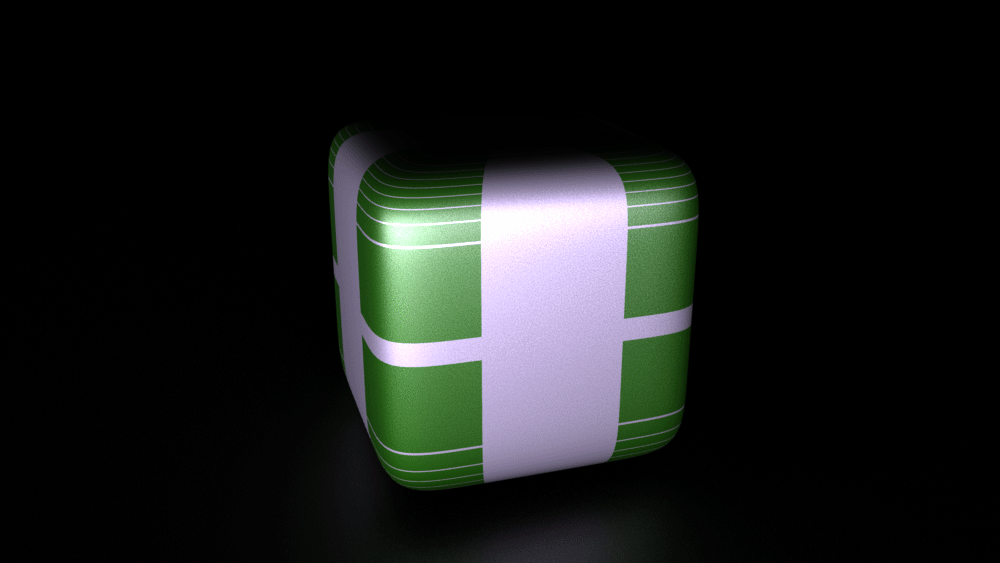
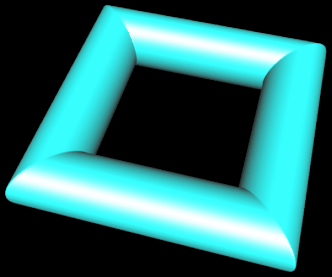

# Laboratório 5: Modelos Poligonais
Para a atividade do laboratório 5 da disciplina de Computação Gráfica, montei telas com uma superelipsoide ou um super toro girando ao redor do eixo Y. Para rodar o projeto, é importante ter a pasta [Assets](https://github.com/aapolinariojr/Assets) na raíz do web server que está o executando. Em todas as telas, há uma interface gráfica gerada com o a biblioteca lil-gui que permite que o usuário interaja com o que está sendo mostrado alterando parâmetros que modificam o que é exibido na tela. Me baseei no código do professor, como requisitado, mas realizei algumas mudanças, explicadas e justificadas a seguir:
## Geometria e Forma: Uso do Vertex Shader
Para gerar a malha 3D utilizada como exemplo pelo professor, ele calculou as posições dos vértices da geometria na CPU de acordo com a equação paramétrica da figura representada. Como a figura é estática, isso não é um grande problema. Entretanto, nas aplicações que adicionei ao projeto, os objetos se deformam, seja pelo manuseio manual dos parâmetros pelo usuário através da GUI, ou pela modificação automática dos parâmetros em função do tempo nas versões animadas das telas. Assim, recalcular a nova geometria na CPU toda vez que houvesse qualquer modificação dos parâmetros seria muito custoso, uma vez que isso acontece várias vezes por segundo e envolveria a execução de um loop iterando por todos os vértices e os ligando para formar a malha. Pensando nisso, decidi fazer uso do vertex shader para calcular a posição dos vértices.
Nas aplicações que escrevi, a geometria é calculada uma única vez, e os parâmetros são passados como variáveis do tipo `uniform` para a o vertex shader, que então calcula a posição de todos os vértices de forma paralela, fazendo bom uso da capacidade de paralelismo da GPU. Quando há uma mudança nos parâmetros (que se torna uma mudança passada para GPU através das variáveis `uniform`), a própria GPU recalcula a posição dos vértices, sem ncessidade de gerar uma nova geometria com um loop na CPU e então passar essa geometria para a GPU, o que seria um grande desperdício de recursos. 
## Cores: Uso do Fragment Shader
Para colorir as malhas utilizadas como exemplo na atividade, o professor determinou as cores de cada vértice na CPU, durante o loop de geração da geometria, e passou essa informação para GPU. Essa abordagem se torna ineficiente quando surge o requisito proposto no exercício 3 do laboratório, que pede um padrão de coloração da superfície que varie em função da mudança de forma dos objetos. Para evitar o processo custoso de rodar um loop na CPU calculando as cores de cada vértice a cada vez que os parâmetros forem alterados (o que acontece múltiplas vezes por segundo de maneira constante nas figuras animadas) e então ter que passar o array de cores com a informação da coloração de todos os vértices para a GPU, escrevi um Fragment Shader que também possui diversas variáveis `uniform` controladas a partir da interface gráfica. Este shader é o responsável pelo padrão de coloração dos objetos e, tal qual a abordagem descrita na seção acima, faz bom uso do paralelismo da GPU e evita a transferência desnecessária de informação entre a CPU e a GPU. Pessoalmente, os modos de visualização que achei mais encantadores foram os dois primeiros que coloquei no menu da interface: o que varia a matiz em função da distância de um ponto central configurável pela GUI e o que intercala entre utilizar as coordenadas XYZ de cada ponto como os valores RGB e como os valores HSL baseado numa onda senoidal em função da distância do mesmo ponto central do modo anterior.

Por fim, optei por manter a decisão do professor de descartar o array de vértices da CPU uma vez que a geometria já foi enviada para a GPU, a fim de não desperdiçar espaço na CPU. O uso de memória da CPU também é mitigado durante a execução da aplicação graças as abordagens explicadas acima, uma vez que não estamos constantemente enchendo um array na CPU com coordenadas XYZ de cada vértice ou o RGB das cores de cada um dos vértices.

## Relatório como solicitado nas especificações da atividade:
Segue uma síntese das informações acima estruturada conforme especificado na atividade:
1. Exercício 1: A geração da malha poligonal no programa economiza memória da CPU ao descartar o array de vértices após serem enviados à GPU, e ao nem montar um array de cores em primeiro lugar (o cálculo das cores fica a cargo da GPU através do fragment shader). A ausência do envio de um array de cores de cada vértice também evita transferência de informações desnecessárias entre a CPU e GPU.
2. Exercício 2: Utilizar um vertex shader para calcular as cores da superfície economiza recursos computacionais de várias maneiras. Primeiramente, ao invés de recalcular as coordenadas dos vértices na CPU e enviar um array de coordenadas para a GPU toda vez que há uma mudança nos parâmetros, o vertex shader permite que a GPU calcule as coordenadas diretamente. Isso elimina a necessidade de transferir grandes quantidades de dados entre a CPU e a GPU. Além disso, a GPU é otimizada para operações paralelas, o que significa que pode calcular as coordenadas da posição de cada vértice de forma simultânea e muito mais rápida do que a CPU poderia fazer sequencialmente. Isso resulta em uma renderização mais eficiente e responsiva, especialmente nessa aplicação, onde os vértices da superfície mudam de posição frequentemente, durante as animações ou interações em tempo real do usuário através da interface gerada com o lil-gui. Por fim, não gerar arrays de coordenadas o tempo todo evita uso desnecessário da memória da CPU.
3. Exercíco 3: De forma similar a forma como o vertex shader economiza recursos de processamento, armazenamento e transferência de informações entre a CPU e GPU, o uso do fragment shader para calcular as cores da superfície também otimiza o cálculo das cores ao fazer proveito da capacidade de paralelismo da GPU, economiza espaço na CPU ao evitar a criação de grandes arrays de cores, e não transmite arrays de cores entre a CPU e a GPU.

# Especificações da Atividade:
## Objetivos:

1. Compreender como o modelo baseado em malha poligonal é criado e gerenciado pelo *Three.JS*;
2. Identificar os mecanismos oferecidos no *Three.JS* para leitura de modelos 3D em formato de malha poligonal;
3. Aprofundar no processo de geração de malhas poligonais a partir da formulação paramétrica.

## Exercício:

1. Formas geométricas interessantes podem ser geradas a partir de uma mesma forma algébrica básica. Esse é o caso das super-quádricas [1], que permitem gerar formas como:  

  * Super-elipsoide [2];
  * Super-toroide [3]. 

  Crie duas aplicações que gerem as malhas poligonais dessas duas formas geométricas, utilizando como base o código do exemplo "*02-Malha-3D*". (**valor 1,5 ptos por item**) 

2. Controlando os parâmetros que definem as super-quádricas é possível gerar variações de suas formas básicas, como mostram as Figuras **1** e **2**. 

 

*Figura 1 - Super Elipsoide: evolução da forma a partir da mudanças de seus parâmetros.*

 

*Figura 2 - Super Toro: evolução da forma a partir da mudanças de seus parâmetros.*

  Crie mais duas aplicações que permitam visualiza, de forma automática (animação) a mudança dos parâmetros das duas formas e a nova geometria gerada. (**valor 2,0 ptos por item**)

3. Para tornar a animação mais atrativa, crie um padrão de coloração da superfície que também varie em função da mudança da forma. Use sua criatividade e seu conhecimento sobre sistemas de cores! (**valor 1,0 pto por item**)

## Requisitos:

Ao se trabalhar com modelos geométricos, seja na geração, animação ou renderização, como proposto nesse exercício, há que se pensar em como a implementação deve ser feita para que os recursos de **processamento**, **armazenamento** e **transferência de dados** entre **CPU** e **GPU** não sejam desperdiçados. 

Para cada item desse Laboratório, avalie como esses requisitos afetam a tarefa a ser executada, e procure adequar a sua implementação considerando garantir os 3 requisitos. Descreva no **README** do seu repositório, para cada item, quais os requisitos se aplicam e como sua solução fez para atende-los. (**valor 1,0 pto**)

## Referências: 

  [1]   Wikipedia. **Superquadrics**. https://en.wikipedia.org/wiki/Superquadrics
  
  [2]   Wikipedia. **Superellipsoid**. https://en.wikipedia.org/wiki/Superellipsoid
  
  [3]   Wikipedia. **Supertoroid**. https://en.wikipedia.org/wiki/Supertoroid
  
  [4]   Dirksen, Jos. **Learn Three. js**. Packt Publishing Ltd, 4th Edition. 2023.
  
  [5]   *Three.JS*. **Loading 3D models**. https://threejs.org/docs/index.html#manual/en/introduction/Loading-3D-models
